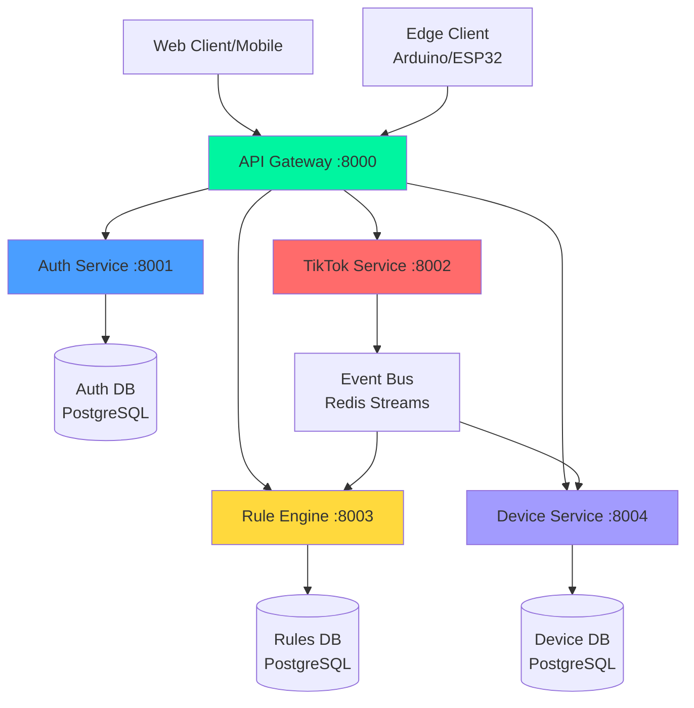

# TikTok LIVE Realtime Interaction Platform
## Microservices Architecture

> **Cloud-native SaaS platform** enabling TikTok streamers to control hardware via realtime livestream interactions

---

## 🏗️ Architecture Overview

### Microservices Design



---

## 📦 Services

### 1. **API Gateway** (Port 8000)
**Purpose:** Single entry point, routing, authentication

**Responsibilities:**
- Request routing to microservices
- JWT validation
- Rate limiting
- Load balancing
- API documentation aggregation

**Tech Stack:**
- FastAPI
- Redis (caching)
- Nginx (production)

---

### 2. **Auth Service** (Port 8001)
**Purpose:** User authentication & authorization

**Responsibilities:**
- User registration/login
- JWT token generation
- Password management
- Workspace management (multi-tenancy)
- RBAC (Role-Based Access Control)

**Database:** PostgreSQL (auth_db)
- `users`
- `workspaces`
- `workspace_members`
- `sessions`

**API Endpoints:**
- `POST /register`
- `POST /login`
- `POST /refresh`
- `GET /me`
- `POST /workspaces`

---

### 3. **TikTok Service** (Port 8002)
**Purpose:** TikTok LIVE integration & event processing

**Responsibilities:**
- Connect to TikTok LIVE streams
- Process realtime events (comments, gifts, likes)
- Publish events to Event Bus
- Handle reconnections
- Rate limit management

**Database:** PostgreSQL (tiktok_db)
- `livestreams`
- `tiktok_connections`
- `event_logs`

**Event Bus:** Redis Streams
- Publish: `comment`, `gift`, `like`, `join`, `follow`

**API Endpoints:**
- `POST /connect` - Connect to TikTok LIVE
- `POST /disconnect`
- `GET /status`
- `GET /events` - Event stream (SSE)

---

### 4. **Rule Engine** (Port 8003)
**Purpose:** Event → Action mapping & execution

**Responsibilities:**
- Define rules (triggers + actions)
- Match events to rules
- Execute actions
- Cooldown management
- Analytics tracking

**Database:** PostgreSQL (rules_db)
- `rules`
- `rule_executions`
- `analytics`

**Event Bus:** Redis Streams
- Subscribe: All TikTok events
- Publish: `action_triggered`

**API Endpoints:**
- `POST /rules` - Create rule
- `GET /rules`
- `PUT /rules/{id}`
- `DELETE /rules/{id}`
- `GET /analytics`

---

### 5. **Device Service** (Port 8004)
**Purpose:** Hardware device management & control

**Responsibilities:**
- Device registration (Arduino/ESP32)
- Agent token management
- Command execution
- Device status monitoring
- Safety checks

**Database:** PostgreSQL (device_db)
- `devices`
- `agent_tokens`
- `command_queue`
- `device_logs`

**Event Bus:** Redis Streams
- Subscribe: `action_triggered`
- Publish: `command_sent`, `device_status`

**API Endpoints:**
- `POST /devices` - Register device
- `GET /devices`
- `POST /devices/{id}/command`
- `GET /devices/{id}/status`
- `POST /tokens` - Generate agent token

---

## 🔄 Event Flow

### Example: User sends "spin" comment

```
1. TikTok LIVE → TikTok Service
   └─ Receives CommentEvent("spin")

2. TikTok Service → Event Bus
   └─ Publishes: {type: "comment", text: "spin", user: "..."}

3. Event Bus → Rule Engine
   └─ Matches rule: "comment contains 'spin' → motor_spin"

4. Rule Engine → Event Bus
   └─ Publishes: {type: "action", action: "motor_spin", device_id: "..."}

5. Event Bus → Device Service
   └─ Sends command to Edge Client

6. Edge Client → Arduino
   └─ Executes: digitalWrite(motorPin, HIGH)
```

**Total Latency:** <200ms ✅

---

## 🗄️ Database Strategy

### Database per Service (Recommended)

Each microservice has its own database:

```
auth_db      (PostgreSQL) - User data
tiktok_db    (PostgreSQL) - Livestream connections
rules_db     (PostgreSQL) - Rules & analytics
device_db    (PostgreSQL) - Devices & commands
```

**Advantages:**
- ✅ Service independence
- ✅ Schema flexibility
- ✅ Fault isolation
- ✅ Independent scaling

**Challenges:**
- ⚠️ No foreign keys across services
- ⚠️ Eventual consistency
- ⚠️ Distributed transactions (use Saga pattern)

---

## 🚀 Technology Stack

### Backend Services
- **Language:** Python 3.11+
- **Framework:** FastAPI
- **ORM:** SQLAlchemy 2.0 (async)
- **Validation:** Pydantic

### Databases
- **Primary:** PostgreSQL 14+
- **Cache:** Redis 7+
- **Event Bus:** Redis Streams

### Communication
- **Sync:** HTTP/REST (service-to-service)
- **Async:** Redis Streams (event-driven)
- **Real-time:** WebSocket (client-facing)

### DevOps
- **Containerization:** Docker
- **Orchestration:** Docker Compose (dev), Kubernetes (prod)
- **CI/CD:** GitHub Actions
- **Monitoring:** Prometheus + Grafana
- **Logging:** ELK Stack

---

## 📁 Project Structure

```
tiktok-live-platform/
├── services/
│   ├── api-gateway/
│   │   ├── Dockerfile
│   │   ├── app/
│   │   │   ├── main.py
│   │   │   ├── routes/
│   │   │   └── middleware/
│   │   └── requirements.txt
│   │
│   ├── auth-service/
│   │   ├── Dockerfile
│   │   ├── app/
│   │   │   ├── main.py
│   │   │   ├── models/
│   │   │   ├── api/
│   │   │   └── services/
│   │   ├── alembic/
│   │   └── requirements.txt
│   │
│   ├── tiktok-service/
│   │   ├── Dockerfile
│   │   ├── app/
│   │   │   ├── main.py
│   │   │   ├── tiktok_client.py
│   │   │   ├── event_publisher.py
│   │   │   └── api/
│   │   └── requirements.txt
│   │
│   ├── rule-engine/
│   │   ├── Dockerfile
│   │   ├── app/
│   │   │   ├── main.py
│   │   │   ├── rule_matcher.py
│   │   │   ├── action_executor.py
│   │   │   └── api/
│   │   ├── alembic/
│   │   └── requirements.txt
│   │
│   └── device-service/
│       ├── Dockerfile
│       ├── app/
│       │   ├── main.py
│       │   ├── device_manager.py
│       │   ├── command_queue.py
│       │   └── api/
│       ├── alembic/
│       └── requirements.txt
│
├── shared/
│   ├── proto/              # Protobuf definitions
│   ├── events/             # Event schemas
│   └── utils/              # Shared utilities
│
├── edge-client/            # Arduino/ESP32 client
│   ├── python/
│   └── arduino/
│
├── frontend/               # React frontend
│   └── ...
│
├── docker-compose.yml      # All services
├── docker-compose.dev.yml  # Development
├── docker-compose.prod.yml # Production
├── kubernetes/             # K8s manifests
│   ├── deployments/
│   ├── services/
│   └── ingress/
│
└── README.md
```

---

## 🔐 Security

### Service-to-Service Authentication
- **Internal:** mTLS (mutual TLS)
- **API Gateway:** JWT validation
- **Service Mesh:** Istio (production)

### Data Security
- **At Rest:** Database encryption
- **In Transit:** TLS 1.3
- **Secrets:** Vault / K8s Secrets

### Edge Client Security
- **Agent Tokens:** Unique per device
- **Command Whitelist:** Only allowed commands
- **Rate Limiting:** Prevent abuse

---

## 📊 Scalability

### Horizontal Scaling

Each service scales independently:

```yaml
# Example: Scale TikTok Service
docker-compose up --scale tiktok-service=5
```

### Load Balancing

```
API Gateway (Nginx)
    ├─ Auth Service (3 instances)
    ├─ TikTok Service (5 instances)  ← High load
    ├─ Rule Engine (2 instances)
    └─ Device Service (2 instances)
```

### Database Scaling

- **Read Replicas:** PostgreSQL streaming replication
- **Sharding:** By workspace_id
- **Caching:** Redis for hot data

---

## 🧪 Development Workflow

### Local Development

```bash
# Start all services
docker-compose -f docker-compose.dev.yml up

# Start specific service
docker-compose up auth-service

# View logs
docker-compose logs -f tiktok-service

# Run tests
docker-compose exec auth-service pytest
```

### Service Dependencies

```yaml
# docker-compose.dev.yml
services:
  auth-service:
    depends_on:
      - auth-db
      - redis
  
  tiktok-service:
    depends_on:
      - tiktok-db
      - redis
      - auth-service  # For token validation
```

---

## 🎯 Deployment Strategy

### Development
- Docker Compose
- Local databases
- Hot reload enabled

### Staging
- Kubernetes (Minikube/K3s)
- Managed databases (AWS RDS)
- CI/CD testing

### Production
- Kubernetes (EKS/GKE/AKS)
- Multi-region
- Auto-scaling
- Blue-green deployment

---

## 📈 Monitoring & Observability

### Metrics (Prometheus)
- Request rate
- Error rate
- Latency (p50, p95, p99)
- Service health

### Logging (ELK)
- Centralized logs
- Correlation IDs
- Error tracking

### Tracing (Jaeger)
- Distributed tracing
- Request flow visualization
- Performance bottlenecks

---

## 🚦 API Gateway Routes

```
/api/v1/auth/*           → Auth Service
/api/v1/livestreams/*    → TikTok Service
/api/v1/rules/*          → Rule Engine
/api/v1/devices/*        → Device Service
/api/v1/workspaces/*     → Auth Service
```

---

## 🔄 Migration from Monolith

### Phase 1: Extract Auth Service
1. Create auth-service
2. Migrate user/workspace tables
3. Update API Gateway routing

### Phase 2: Extract TikTok Service
1. Create tiktok-service
2. Setup Redis Streams
3. Migrate livestream logic

### Phase 3: Extract Rule Engine
1. Create rule-engine
2. Subscribe to events
3. Migrate rule execution

### Phase 4: Extract Device Service
1. Create device-service
2. Migrate device management
3. Setup command queue

---

## 📝 Next Steps

1. ✅ Design microservices architecture (DONE)
2. [ ] Setup project structure
3. [ ] Implement API Gateway
4. [ ] Implement Auth Service
5. [ ] Implement TikTok Service
6. [ ] Setup Redis Streams
7. [ ] Implement Rule Engine
8. [ ] Implement Device Service
9. [ ] Create Docker Compose
10. [ ] Test end-to-end flow

---

## 🎓 Learning Resources

- [Microservices Patterns](https://microservices.io/patterns/)
- [FastAPI Best Practices](https://fastapi.tiangolo.com/)
- [Redis Streams](https://redis.io/docs/data-types/streams/)
- [Event-Driven Architecture](https://martinfowler.com/articles/201701-event-driven.html)

---

**Architecture:** Microservices  
**Status:** 🚧 Design Phase  
**Version:** 2.0.0  
**Last Updated:** 2026-01-07
